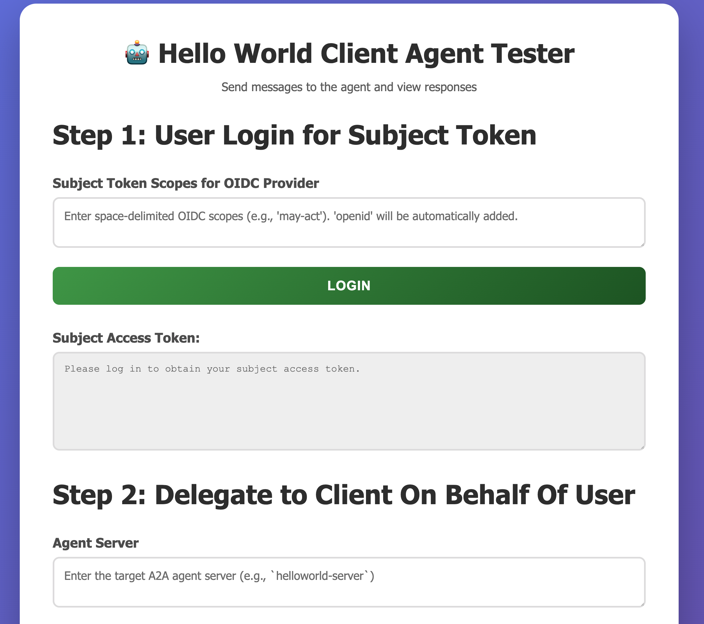
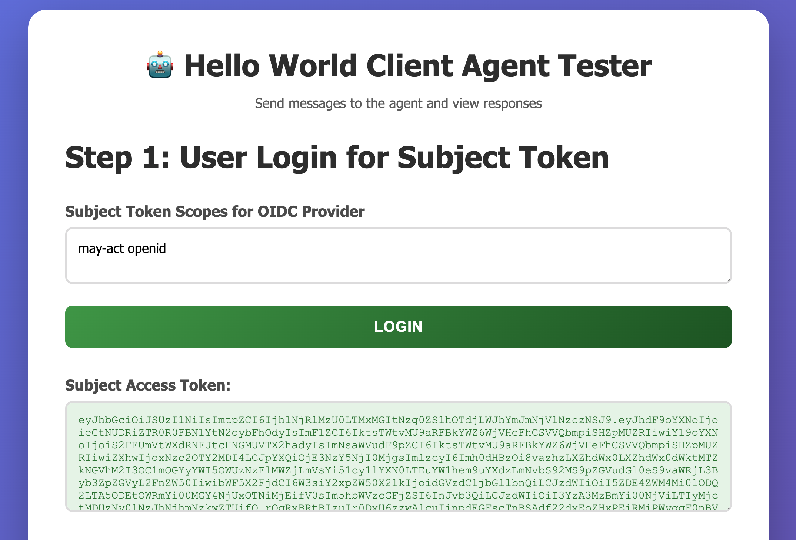
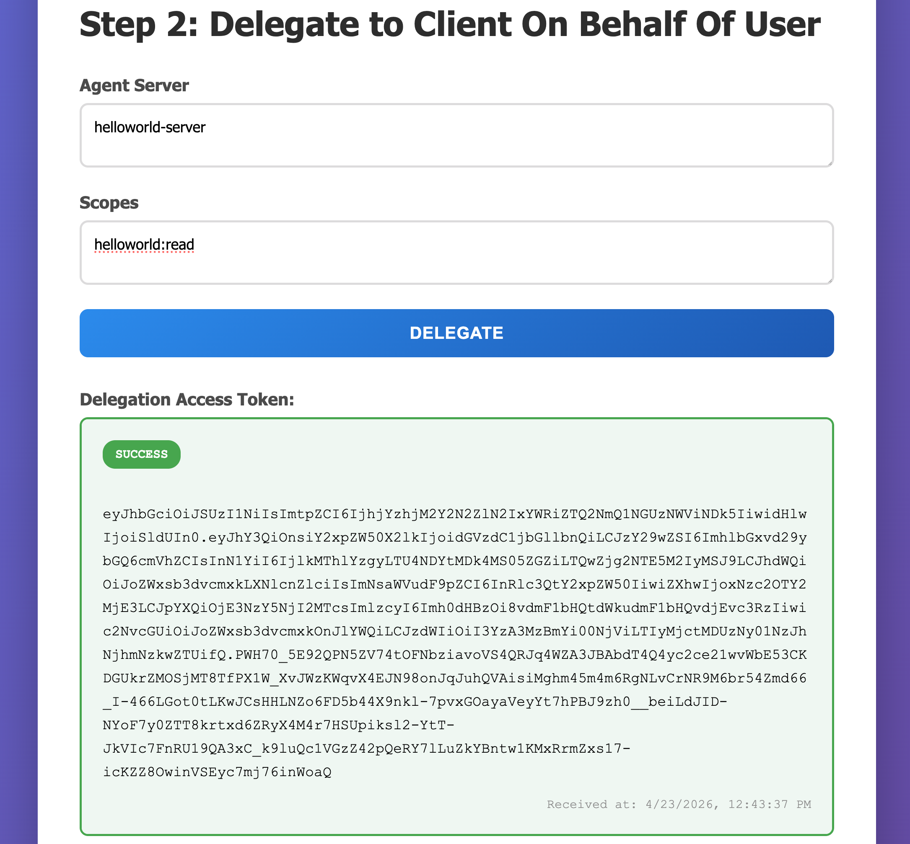
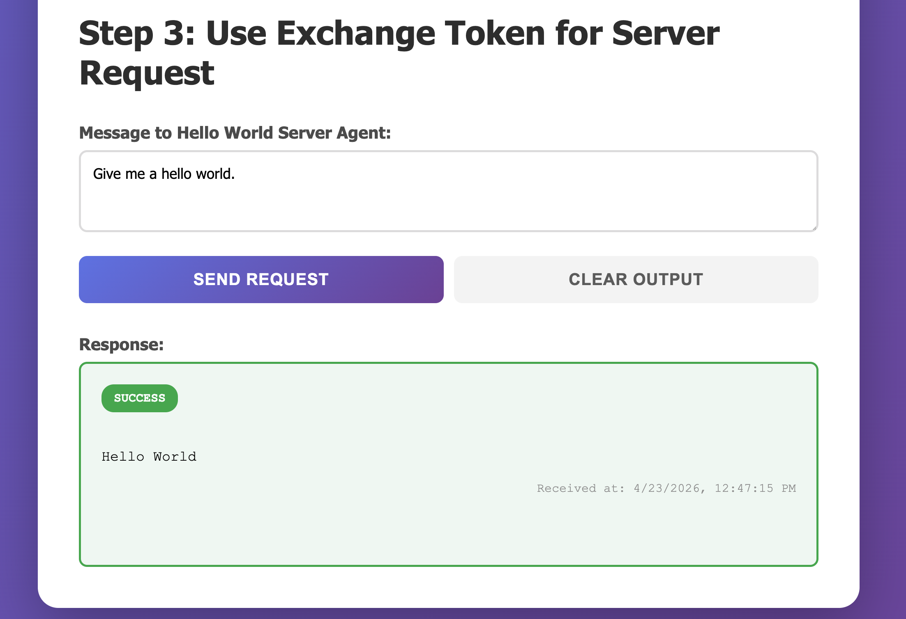
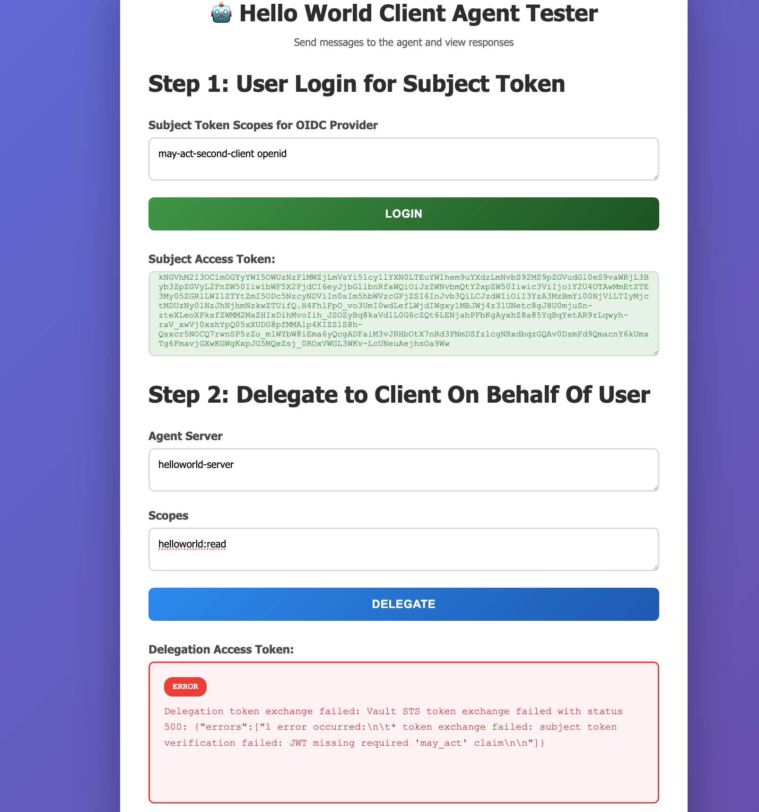
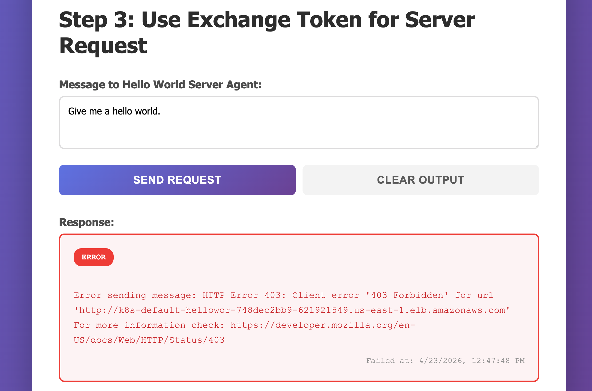
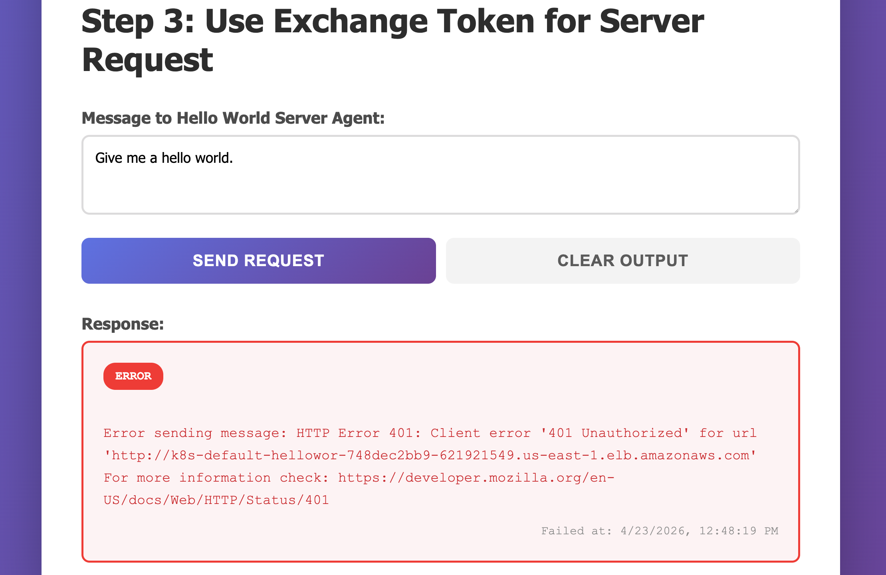

# Example repository for infrastructure-agent

This example repository includes demo code for:

- Agents using [Agent2Agent protocol](https://a2a-protocol.org/latest/) and [HashiCorp Vault](https://developer.hashicorp.com/vault/docs/secrets/identity/oidc-provider) as an OIDC provider on Kubernetes
- [LangFlow](https://www.langflow.org/), OpenSearch, Ollama (with Granite 4) deployed on AWS EKS

## Prerequisites

- AWS account
- [HCP Terraform](https://developer.hashicorp.com/terraform/cloud-docs)
- Docker (for pushing images)

### Set up HCP Terraform

Log into HCP Terraform.

#### Overview of Required Workspaces

This project requires **four workspaces** to be created in HCP Terraform under the `infrastructure-agent` project:

1. **`base`** - Deploys base AWS infrastructure (EKS cluster, ECR repositories, VPC, KMS)
   - Working Directory: `terraform/base`
   - Shares state with: `kubernetes`, `vault`, `helloworld`

2. **`kubernetes`** - Deploys Kubernetes resources and Vault OIDC configuration
   - Working Directory: `terraform/kubernetes`
   - Shares state with: `vault`, `helloworld`
   - Depends on: `base`

3. **`vault`** - Configures Vault authentication and authorization
   - Working Directory: `terraform/vault`
   - Shares state with: `helloworld`
   - Depends on: `base`, `kubernetes`

4. **`helloworld`** - Deploys the agent applications
   - Working Directory: `terraform/helloworld`
   - Depends on: `base`, `kubernetes`, `vault`

#### Create Project

- Create a new project called `infrastructure-agent`. It groups the workspaces related to this repository.

#### Configure Organization Variables

- Go to "Settings".

- Go to "Variable Sets".

- Create an organization variable set.

- Apply to the `infrastructure-agent` project (or all workspaces).

- Add the following variables:
    - `aws_region`
    - `environment`
    - `inbound_cidrs_for_lbs`
    - `project_name`
    - AWS credentials (preferred using environment variables)

### Deploy base infrastructure

To deploy the VPC, Kubernetes cluster, AWS KMS, and add-ons,
create the following in HCP Terraform.

- Create a workspace called `base`.

- Set the project to `infrastructure-agent`.

- Go to "Settings".

- Scroll down to "Remote state sharing".

- Select "Share with specific workspaces".

- Add the following workspaces:
    - `kubernetes`
    - `vault`
    - `helloworld`

- Go to "Version Control".

- Connect the workspace to this repository (`joatmon08/infrastructure-agent`).

- Update "Terraform Working Directory" to `terraform/base`.

- Under "Automatic Run triggering", set to "Only trigger when files in specified paths change".

- Update the "Syntax" to "Patterns".

- Add the pattern `terraform/base/**/*`.

Run a plan and apply.

### Deploy components onto Kubernetes

To deploy the Vault cluster, ingress endpoints, and
load balancers to the Kubernetes cluster, create the following in HCP Terraform.

- Create a workspace called `kubernetes`.

- Set the project to `infrastructure-agent`.

- Go to "Settings".

- Scroll down to "Remote state sharing".

- Select "Share with specific workspaces".

- Add the following workspaces:
    - `vault`
    - `helloworld`

- Go to "Version Control".

- Connect the workspace to this repository (`joatmon08/infrastructure-agent`).

- Update "Terraform Working Directory" to `terraform/kubernetes`.

- Under "Automatic Run triggering", set to "Only trigger when files in specified paths change".

- Update the "Syntax" to "Patterns".

- Add the pattern `terraform/kubernetes/**/*`.

- Go to "Variables".

- Add the following workspace variables:
    - `vault_token` (sensitive) - The Vault root token from the initialization step
    - `inbound_cidrs_for_lbs` (HCL) - List of CIDR blocks allowed to access load balancers (can override with `["0.0.0.0/0"]`)

Run a plan and apply.

### Initialize Vault

Vault needs to be initialized before you configure it.

- Configure `kubectl` to use the EKS cluster with `aws eks update-kubeconfig --region us-east-1 --name infra-agent`.

- Run `bash scripts/vault-init.sh`

This should store the Vault root token and unseal keys in `secrets/vault-init.json`

### Configure Vault

To configure the Vault cluster as an OIDC provider, identity secrets engine,
and register the custom secrets engine, create the following in HCP Terraform.

- Create a workspace called `vault`.

- Set the project to `infrastructure-agent`.

- Go to "Settings".

- Scroll down to "Remote state sharing".

- Select "Share with specific workspaces".

- Add the following workspace:
    - `helloworld`

- Go to "Version Control".

- Connect the workspace to this repository (`joatmon08/infrastructure-agent`).

- Update "Terraform Working Directory" to `terraform/vault`.

- Under "Automatic Run triggering", set to "Only trigger when files in specified paths change".

- Update the "Syntax" to "Patterns".

- Add the pattern `terraform/vault/**/*`.

- Go to "Variables".

- Add the following workspace variables:
    - `tfc_organization` - Your Terraform Cloud organization name (e.g., `rosemary-production`)
    - `vault_token` (sensitive) - Copy the Vault root token from `secrets/vault-init.json`.
    - `client_agents` (HCL) - Map of client agents with their Kubernetes namespace and claims

Run a plan and apply.

## Agent2Agent with Vault as OIDC provider

This demo deploys two example agents, `helloworld-agent` and `test-client`.
Each of them use [Agent2Agent protocol](https://a2a-protocol.org/latest/) for agent
discovery and communication. The extended agent skills in `helloworld-agent` require proper authentication
and authorization by Vault in order for other agents to access.

- **end-user** - A Vault userpass authentication user that is allowed to access the Vault OIDC endpoints
- **test-client** - Vault authentication role that allows access to OIDC endpoints for the test-client Kubernetes service account

The configuration also creates services on Kubernetes for `test-client` and `helloworld-agent-server`.

- **helloworld-agent-server** - Uses a Kubernetes ingress with AWS ALB for access
- **test-client** - Uses a Kubernetes service with AWS NLB for access

### Build the agent images

Build the images for the helloworld agents. They deploy images to AWS ECR.

- Run `build-helloworld.sh` to automatically build and push to the account ECR repositories.

    ```bash
    bash build-helloworld.sh
    ```

### Deploy the agents to Kubernetes

- Create a workspace called `helloworld`.

- Set the project to `infrastructure-agent`.

- Go to "Version Control".

- Connect the workspace to this repository (`joatmon08/infrastructure-agent`).

- Update "Terraform Working Directory" to `terraform/helloworld`.

- Under "Automatic Run triggering", set to "Only trigger when files in specified paths change".

- Update the "Syntax" to "Patterns".

- Add the pattern `terraform/helloworld/**/*`.

- Go to "Variables".

- Add the following workspace variable:
    - `tfc_organization` - Your Terraform Cloud organization name (e.g., `rosemary-production`)

Note: Most variables have defaults in `terraform.auto.tfvars` and can be overridden if needed.

Run a plan and apply.

This will deploy the Kubernetes deployment and service for the helloworld-agent-server.
The agent will be accessible via the ingress created in the `kubernetes` workspace.

### Try the agents

After deploying the components for this demo, you can access the test-client agent UI at:

```bash
open $(cd terraform/kubernetes && terraform output -raw test_client_url)
```

This opens an A2A client with a UI. This UI demonstrates the authorization flow
step-by-step. The workflow should be implemented as part of the client agent
or user interface.



Define the scopes you want to assign to the `end-user`'s subject token.
In this example, we want the `may-act` claim with a list of entities
and clients that can act on behalf of `end-user`.



Use the "Login" button, which redirects you
to Vault as an OIDC provider.

Log into Vault using the `end-user` username and password.

```shell
source secrets.env
vault kv get credentials/end-user
```

You will get a subject token that includes a `may-act` claim. The `test-client` already has an actor token it
requested from Vault's identity secrets engine.

```json
{
  "at_hash": "xkMP4be4tGAA7V-7j2lXNw",
  "aud": "KlMko1OZDPdafzZ5GxXBIUPnjbHvi1FQ",
  "c_hash": "KaDRemYwQ4RmpsF1ES_hZw",
  "client_id": "KlMko1OZDPdafzZ5GxXBIUPnjbHvi1FQ",
  "exp": 1776966028,
  "iat": 1776962428,
  "iss": "$VAULT_ADDR/v1/identity/oidc/provider/agent",
  "may_act": [
    {
      "client_id": "test-client",
      "sub": "9d18ec82-5846-0981-9dfb-40f865193b21"
    }
  ],
  "namespace": "root",
  "sub": "7c0730fb-465b-2227-0537-572a68f790e5"
}
```

Next, get the delegated access token for `test-client` to use. Enter in the agent server's name
(must match the name of agent server in its agent card) and
the scopes you want to request from the agent server (`helloworld:read`).



You will get an access token that includes an `act` claim indicating delegated access.

```json
{
  "act": {
    "client_id": "test-client",
    "scope": "helloworld:read",
    "sub": "9d18ec82-5846-0981-9dfb-40f865193b21"
  },
  "aud": "helloworld-server",
  "client_id": "test-client",
  "exp": 1776966682,
  "iat": 1776963082,
  "iss": "https://vault-ui.vault/v1/sts",
  "scope": "helloworld:read",
  "sub": "7c0730fb-465b-2227-0537-572a68f790e5"
}
```

If the access token defines the correct scope (`helloworld:read`)
and sends a request to `helloworld-server`, your agent gets a 200 SUCCESS
with a "Hello World" message.



If your client agent does not have a `client_id` or `sub` (Vault entity ID)
that matches the one requested by the subject token, your client agent cannot get a
delegated access token.




If your client agent does not define the proper scopes and sends
a request to the `helloworld-server`, your agent gets a 403 FORBIDDEN for accessing helloworld skills.



If your client agent uses an access token that was intended for a
different agent server (e.g, `a-different-server`) and you use it to
request a message from `helloworld-server`, your agent gets a 401 UNAUTHORIZED
for accessing the wrong agent server.




## LangFlow

Update `langflow-build.sh` to the correct ECR repository.

Build the images and push them to ECR.

```sh
bash build.sh
```

Go to `/kubernetes` and deploy the following:

```sh
kubectl apply -f ollama.yaml
kubectl apply -f langflow-ingress.yaml
kubectl apply -f terraform-mcp-server.yaml
```

Go to `/helm` and deploy the following:

```sh
bash langflow.sh
bash opensearch.sh
```

This creates a set of pods for LangFlow, Ollama, OpenSearch, and the Terraform MCP Server.