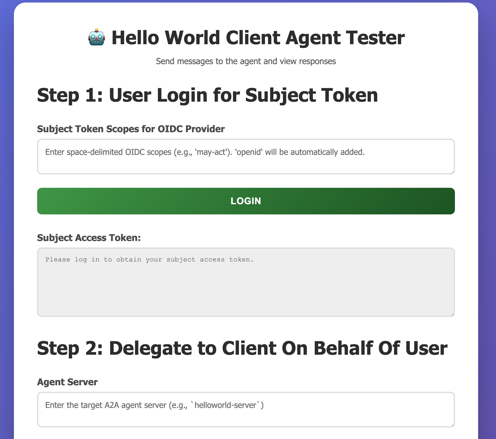
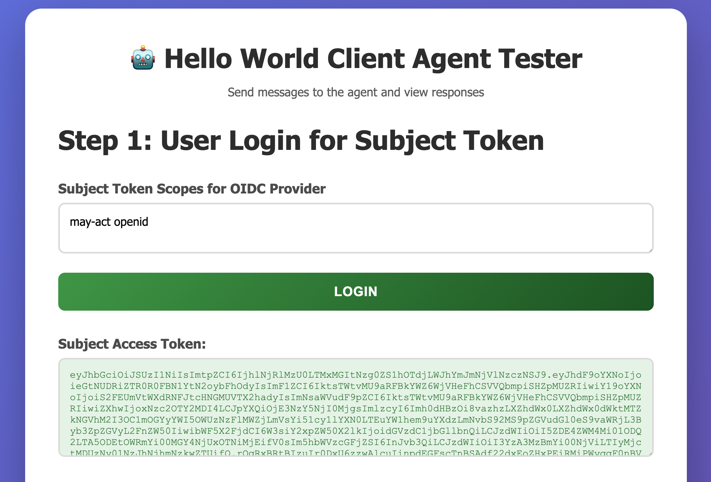
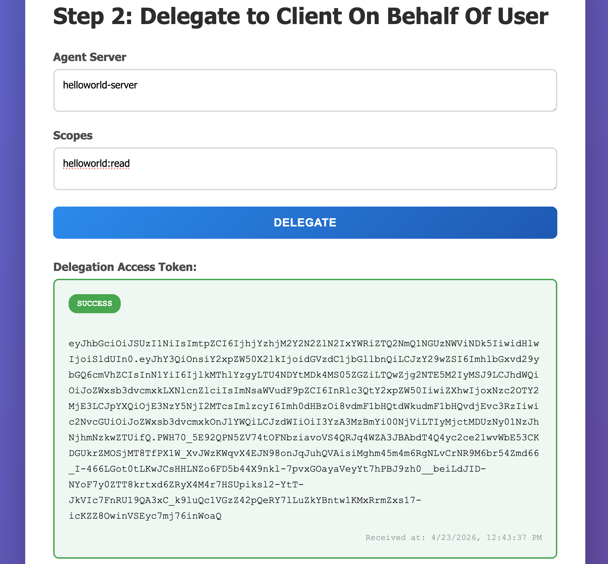
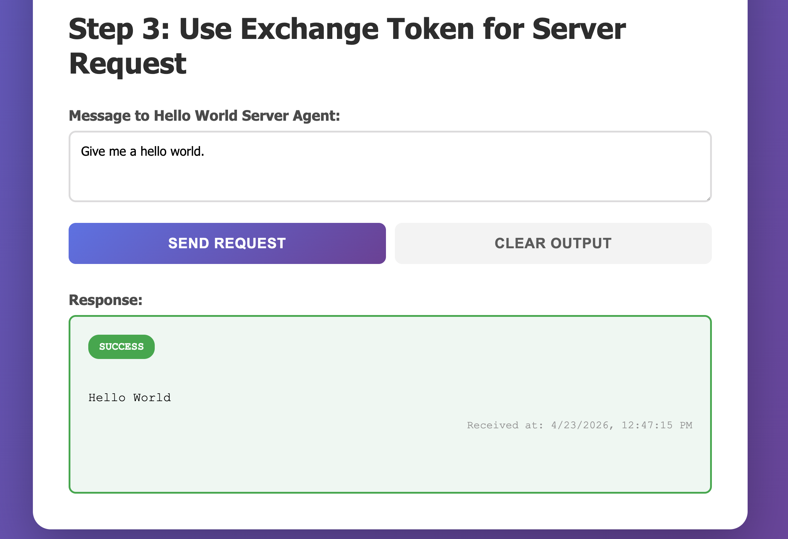
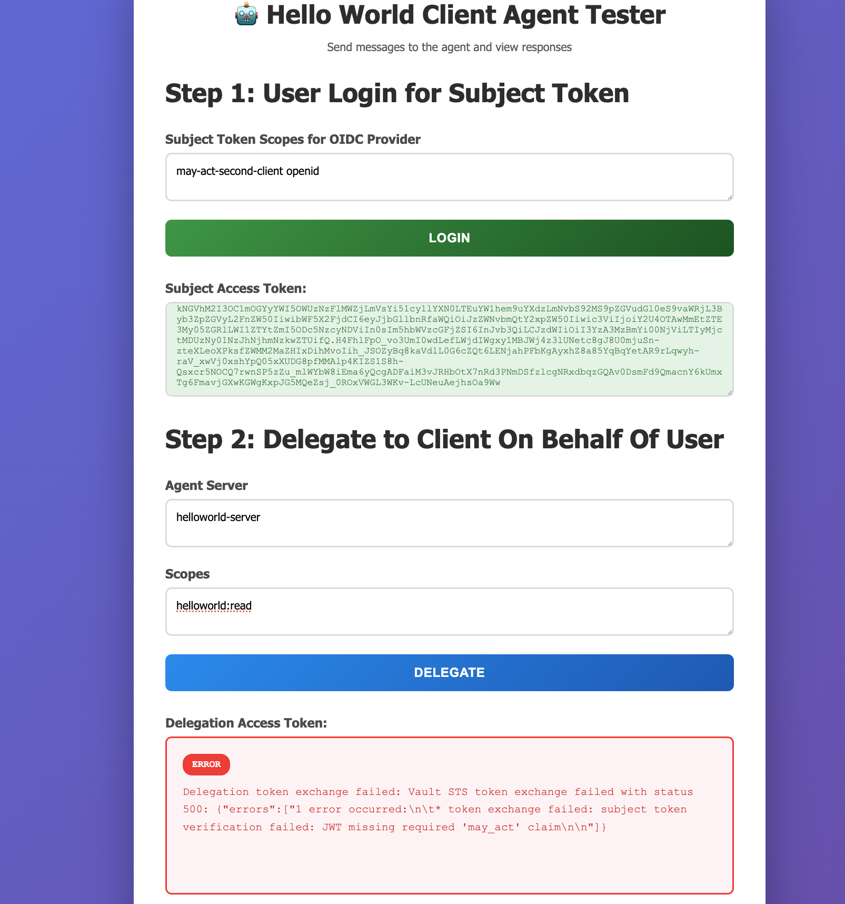
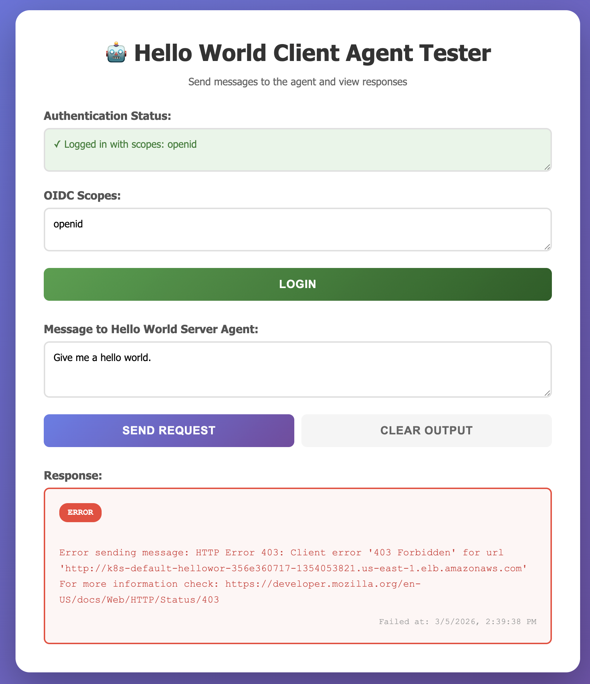
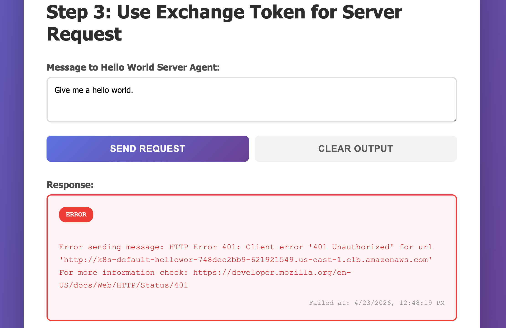

# Example repository for infrastructure-agent

This example repository includes demo code for:

- Agents using [Agent2Agent protocol](https://a2a-protocol.org/latest/) and [HashiCorp Vault](https://developer.hashicorp.com/vault/docs/secrets/identity/oidc-provider) as an OIDC provider on Kubernetes
- [MCP Context Forge](https://github.com/IBM/mcp-context-forge) deployed on AWS EKS

## Prerequisites

- AWS account
- [HCP Terraform](https://developer.hashicorp.com/terraform/cloud-docs)
- Docker (for pushing images)

### Set up HCP Terraform

Log into HCP Terraform.

#### Overview of Required Workspaces

This project requires **five workspaces** to be created in HCP Terraform under the `txc-2026-agent-identity` project:

1. **`txc-base`** - Deploys base AWS infrastructure (VPC, EKS cluster with AMD64 managed node group, ECR repositories, KMS keys, EKS add-ons, AWS Load Balancer Controller)
   - Working Directory: `terraform/base`
   - Shares state with: `txc-kubernetes`, `txc-vault`, `txc-helloworld`, `txc-mcp-context-forge`

2. **`txc-kubernetes`** - Deploys Vault Helm release, ALB ingresses, EFS-backed Vault plugin loader, KMS auto-unseal, TLS, and Vault Secrets Operator
   - Working Directory: `terraform/kubernetes`
   - Shares state with: `txc-vault`, `txc-helloworld`
   - Depends on: `txc-base`

3. **`txc-vault`** - Configures Vault authentication, OIDC provider, identity secrets engine, and the custom `vault-plugin-secrets-oauth-token-exchange` plugin
   - Working Directory: `terraform/vault`
   - Shares state with: `txc-helloworld`
   - Depends on: `txc-base`, `txc-kubernetes`

4. **`txc-helloworld`** - Deploys `helloworld-agent-server` and `test-client` workloads with Vault Secrets Operator CRDs for secret injection
   - Working Directory: `terraform/helloworld`
   - Depends on: `txc-base`, `txc-kubernetes`, `txc-vault`

5. **`txc-mcp-context-forge`** - Deploys MCP Context Forge gateway, PostgreSQL 17, and Redis in the `ai-system` namespace
   - Working Directory: `terraform/mcp-context-forge`
   - Depends on: `txc-base`

#### Create Project

- Create a new project called `txc-2026-agent-identity`. It groups the workspaces related to this repository.

#### Configure Organization Variables

- Go to "Settings".

- Go to "Variable Sets".

- Create an organization variable set.

- Apply to the `txc-2026-agent-identity` project (or all workspaces).

- Add the following variables:
    - `aws_region`
    - `environment`
    - `inbound_cidrs_for_lbs`
    - `project_name`
    - AWS credentials (preferred using environment variables)

### Deploy base infrastructure

To deploy the VPC, Kubernetes cluster, AWS KMS, and add-ons,
create the following in HCP Terraform.

The base workspace provisions an AMD64 EKS managed node group (`AL2023_x86_64_STANDARD`) and installs the AWS Load Balancer Controller via Helm, along with the EBS and EFS CSI drivers.

- Create a workspace called `txc-base`.

- Set the project to `txc-2026-agent-identity`.

- Go to "Settings".

- Scroll down to "Remote state sharing".

- Select "Share with specific workspaces".

- Add the following workspaces:
    - `txc-kubernetes`
    - `txc-vault`
    - `txc-helloworld`
    - `txc-mcp-context-forge`

- Go to "Version Control".

- Connect the workspace to this repository (`joatmon08/infrastructure-agent`).

- Update "Terraform Working Directory" to `terraform/base`.

- Under "Automatic Run triggering", set to "Only trigger when files in specified paths change".

- Update the "Syntax" to "Patterns".

- Add the pattern `terraform/base/**/*`.

Run a plan and apply.

If you need to adopt pre-existing AWS resources into the `base` workspace state, add temporary `import` blocks in [`terraform/base/imports.tf`](terraform/base/imports.tf) and run a plan/apply once to complete the import. Remove those `import` blocks immediately after the import succeeds. Leaving them in place can cause later runs to attempt resource creation before the imported state is available, which is especially problematic for pre-existing CloudWatch log groups such as `/aws/vpc/txc-ai` and `/aws/eks/txc-ai/cluster`.

### Deploy components onto Kubernetes

To deploy the Vault cluster, ingress endpoints, and
load balancers to the Kubernetes cluster, create the following in HCP Terraform.

- Create a workspace called `txc-kubernetes`.

- Set the project to `txc-2026-agent-identity`.

- Go to "Settings".

- Scroll down to "Remote state sharing".

- Select "Share with specific workspaces".

- Add the following workspaces:
    - `txc-vault`
    - `txc-helloworld`

- Go to "Version Control".

- Connect the workspace to this repository (`joatmon08/infrastructure-agent`).

- Update "Terraform Working Directory" to `terraform/kubernetes`.

- Under "Automatic Run triggering", set to "Only trigger when files in specified paths change".

- Update the "Syntax" to "Patterns".

- Add the pattern `terraform/kubernetes/**/*`.

- Go to "Variables".

- Add the following workspace variables:
    - `tfc_organization` - Your Terraform Cloud organization name
    - `vault_token` (sensitive) - The Vault root token from the initialization step
    - `inbound_cidrs_for_lbs` (HCL) - List of CIDR blocks allowed to access load balancers (can override with `["0.0.0.0/0"]`)

Run a plan and apply.

> Note: You may need to re-run this workspace if the load balancer for Vault's ingress is not ready yet. You'll need it in the outputs.

### Initialize Vault

Vault needs to be initialized before you configure it.

- Configure `kubectl` to use the EKS cluster with `aws eks update-kubeconfig --region us-east-1 --name txc-ai`.

- Run `bash scripts/vault-init.sh`

This should store the Vault root token and unseal keys in `secrets/vault-init.json`

### Configure Vault

To configure the Vault cluster as an OIDC provider, identity secrets engine,
and register the custom secrets engine, create the following in HCP Terraform.

- Create a workspace called `txc-vault`.

- Set the project to `txc-2026-agent-identity`.

- Go to "Settings".

- Scroll down to "Remote state sharing".

- Select "Share with specific workspaces".

- Add the following workspace:
    - `txc-helloworld`

- Go to "Version Control".

- Connect the workspace to this repository (`joatmon08/infrastructure-agent`).

- Update "Terraform Working Directory" to `terraform/vault`.

- Under "Automatic Run triggering", set to "Only trigger when files in specified paths change".

- Update the "Syntax" to "Patterns".

- Add the pattern `terraform/vault/**/*`.

- Go to "Variables".

- Add the following workspace variables:
    - `tfc_organization` - Your Terraform Cloud organization name
    - `vault_token` (sensitive) - Copy the Vault root token from `secrets/vault-init.json`.
    - `client_agents` (HCL) - Map of client agents with their Kubernetes namespace and claims
    - `mcp_context_forge_jwt_secret` (sensitive) - JWT signing secret for MCP Context Forge (≥32 bytes)
    - `mcp_context_forge_auth_encryption_secret` (sensitive) - Encryption secret for stored credentials (≥32 bytes)

Generate both secrets before applying:

```bash
python3 -c 'import secrets; print(secrets.token_urlsafe(32))'
```

Run the command twice — once for each variable. Each value must be unique.

Run a plan and apply.

If you deploy the Ollama workspace for the summarizer agent, preload the `llama3.2:3b` model after Terraform finishes:

```bash
source .doormat && bash scripts/ollama-init.sh
```

### Verify the deployment

Before running the repository test suite, sync the root development environment and activate the virtual environment:

```bash
uv sync --group dev
source .venv/bin/activate
```

After the `vault` workspace applies successfully, run the end-to-end tests to verify the cluster, Vault configuration, and deployed summarizer agent:

```bash
source secrets.env && uv run pytest
```

To run only the summarizer end-to-end checks:

```bash
source secrets.env && uv run pytest tests/test_kubernetes_e2e.py -m summarizer
```

`secrets.env` must export the following variables:

| Variable | Description |
|---|---|
| `KUBERNETES_CONTEXT` | `kubectl` context name for the EKS cluster |
| `VAULT_ADDR` | Vault server URL |
| `VAULT_TOKEN` | Vault root token |
| `VAULT_SKIP_VERIFY` | Set to a non-empty value to skip TLS verification |
| `SUMMARIZER_URL` | Base URL of the deployed summarizer agent |

The test suite has three mark groups. The `summarizer` checks currently use a 120 second HTTP timeout to tolerate cold model startup after preload:

- **`kubernetes`** — asserts that the GPU node, Vault server (3 replicas), Vault agent injector, and Vault Secrets Operator pods are all `Running`
- **`vault`** — asserts that Vault is initialized, unsealed, and the `vault-plugin-secrets-oauth-token-exchange` plugin is registered
- **`summarizer`** — asserts that the summarizer agent card is served and its A2A JSON-RPC endpoint returns a completed summary task

## MCP Context Forge

MCP Context Forge is deployed as native Kubernetes resources via Terraform in the
`txc-mcp-context-forge` workspace (`terraform/mcp-context-forge/`). It runs in the
`ai-system` namespace and includes PostgreSQL 17, Redis, and the gateway itself
exposed via an AWS ALB ingress.

Create the `txc-mcp-context-forge` workspace and add the following variables:

- `tfc_organization` - Your Terraform Cloud organization name
- `vault_token` (sensitive) - Vault root token from initialization
- `mcp_admin_email` (optional) - Admin email address (defaults to `admin@example.com`)
- `inbound_cidrs_for_lbs` (HCL, optional) - CIDR blocks for ALB access (defaults to `["0.0.0.0/0"]`)

Apply the workspace after `txc-base` is deployed:

```bash
tfctl run start txc-mcp-context-forge --message="Deploy MCP Context Forge - Approved with IBM Bob"
```

Once applied, retrieve the gateway URL:

```bash
tfctl workspace output txc-mcp-context-forge mcp_context_forge_url
```

### Vault secrets for MCP Context Forge

The Terraform deployment explicitly disables SSO with `SSO_ENABLED=false`, so the admin UI should use the local email/password sign-in flow backed by Vault-managed credentials.

The `txc-vault` workspace generates and stores all MCP Context Forge credentials in Vault KV v2 under the `mcp-context-forge/` mount. These are synced to Kubernetes by the Vault Secrets Operator in the `ai-system` namespace.

| Vault path | Kubernetes secret | Contents |
|---|---|---|
| `mcp-context-forge/data/postgres` | `mcp-postgres` | `POSTGRES_USER`, `POSTGRES_PASSWORD`, `POSTGRES_DB` |
| `mcp-context-forge/data/app` | `mcp-context-forge` | `PLATFORM_ADMIN_PASSWORD`, `DEFAULT_USER_PASSWORD`, `BASIC_AUTH_PASSWORD`, `JWT_SECRET_KEY`, `AUTH_ENCRYPTION_SECRET` |
| `mcp-context-forge/data/database-url` | `mcp-database-url` | `DATABASE_URL` |

`PLATFORM_ADMIN_PASSWORD`, `DEFAULT_USER_PASSWORD`, and `BASIC_AUTH_PASSWORD` are generated as separate Vault values.

Retrieve the admin password after deployment:

```bash
source secrets.env
vault kv get -field=PLATFORM_ADMIN_PASSWORD mcp-context-forge/app
```

## Agent2Agent with Vault as OIDC provider

This demo deploys two example agents, `helloworld-agent` and `test-client`.
Each of them use [Agent2Agent protocol](https://a2a-protocol.org/latest/) for agent
discovery and communication. The extended agent skills in `helloworld-agent` require proper authentication
and authorization by Vault in order for other agents to access.

- **end-user** - A Vault userpass authentication user that is allowed to access the Vault OIDC endpoints
- **test-client** - Vault authentication role that allows access to OIDC endpoints for the test-client Kubernetes service account

The configuration also creates services on Kubernetes for `test-client` and `helloworld-agent-server`.

- **helloworld-agent-server** - Uses a Kubernetes ingress with AWS ALB for access
- **test-client** - Uses a Kubernetes service with AWS NLB for access

### Build the agent images

Agent images are built and pushed to GitHub Container Registry (GHCR) via GitHub Actions workflows in `.github/workflows/`:

| Workflow | Git tag trigger | Image |
|---|---|---|
| `build-helloworld.yml` | `helloworld-v*` | `ghcr.io/joatmon08/helloworld` |
| `build-test-client.yml` | `testclient-v*` | `ghcr.io/joatmon08/test-client` |

Push a tag to trigger a build:

```bash
git tag helloworld-v1.0.0 && git push origin helloworld-v1.0.0
git tag testclient-v1.0.0  && git push origin testclient-v1.0.0
```

Both workflows can also be triggered manually via `workflow_dispatch` in the GitHub Actions UI.

The `txc-helloworld` workspace defaults to `ghcr.io/joatmon08/helloworld:latest` and `ghcr.io/joatmon08/test-client:latest`. Override `helloworld_agent_image` or `test_client_image` workspace variables to pin a specific tag.

### Deploy the agents to Kubernetes

- Create a workspace called `txc-helloworld`.

- Set the project to `txc-2026-agent-identity`.

- Go to "Version Control".

- Connect the workspace to this repository (`joatmon08/infrastructure-agent`).

- Update "Terraform Working Directory" to `terraform/helloworld`.

- Under "Automatic Run triggering", set to "Only trigger when files in specified paths change".

- Update the "Syntax" to "Patterns".

- Add the pattern `terraform/helloworld/**/*`.

- Go to "Variables".

- Add the following workspace variable:
    - `tfc_organization` - Your Terraform Cloud organization name

Note: Most variables have defaults in `terraform.auto.tfvars` and can be overridden if needed.

Run a plan and apply.

This will deploy the Kubernetes deployment and service for the helloworld-agent-server.
The agent will be accessible via the ingress created in the `kubernetes` workspace.

### Try the agents

After deploying the components for this demo, you can access the test-client agent UI at:

```bash
open $(cd terraform/kubernetes && terraform output -raw test_client_url)
```

This opens an A2A client with a UI. This UI demonstrates the authorization flow
step-by-step. The workflow should be implemented as part of the client agent
or user interface.



Define the scopes you want to assign to the `end-user`'s subject token.
In this example, we want the `may-act` claim with a list of entities
and clients that can act on behalf of `end-user`.



Use the "Login" button, which redirects you
to Vault as an OIDC provider.

Log into Vault using the `end-user` username and password. The credentials are stored in Vault KV v2 at `credentials/data/end-user`:

```shell
source secrets.env
vault kv get -field=password credentials/end-user
```

You will get a subject token that includes a `may-act` claim. The `test-client` already has an actor token it
requested from Vault's identity secrets engine.

```json
{
  "at_hash": "xkMP4be4tGAA7V-7j2lXNw",
  "aud": "KlMko1OZDPdafzZ5GxXBIUPnjbHvi1FQ",
  "c_hash": "KaDRemYwQ4RmpsF1ES_hZw",
  "client_id": "KlMko1OZDPdafzZ5GxXBIUPnjbHvi1FQ",
  "exp": 1776966028,
  "iat": 1776962428,
  "iss": "$VAULT_ADDR/v1/identity/oidc/provider/agent",
  "may_act": [
    {
      "client_id": "test-client",
      "sub": "9d18ec82-5846-0981-9dfb-40f865193b21"
    }
  ],
  "namespace": "root",
  "sub": "7c0730fb-465b-2227-0537-572a68f790e5"
}
```

Next, get the delegated access token for `test-client` to use. Enter in the agent server's name
(must match the name of agent server in its agent card) and
the scopes you want to request from the agent server (`helloworld:read`).



You will get an access token that includes an `act` claim indicating delegated access.

```json
{
  "act": {
    "client_id": "test-client",
    "scope": "helloworld:read",
    "sub": "9d18ec82-5846-0981-9dfb-40f865193b21"
  },
  "aud": "helloworld-server",
  "client_id": "test-client",
  "exp": 1776966682,
  "iat": 1776963082,
  "iss": "https://vault-ui.vault/v1/sts",
  "scope": "helloworld:read",
  "sub": "7c0730fb-465b-2227-0537-572a68f790e5"
}
```

If the access token defines the correct scope (`helloworld:read`)
and sends a request to `helloworld-server`, your agent gets a 200 SUCCESS
with a "Hello World" message.



If your client agent does not have a `client_id` or `sub` (Vault entity ID)
that matches the one requested by the subject token, your client agent gets
notice that the token exchange failed since it does not have permission to act
on behalf of the subject token.



If your client agent does not define the proper scopes and sends
a request to the `helloworld-server`, your agent gets a 403 FORBIDDEN for accessing helloworld skills.



If your client agent uses an access token that was intended for a
different agent server (e.g, `a-different-server`) and you use it to
request a message from `helloworld-server`, your agent gets a 401 UNAUTHORIZED
for accessing the wrong agent server.



Note that if you want to have nested delegation (e.g., `second-client` calls on behalf of `test-client`),
you can use the delegated access token from `test-client` as the subject token for `second-client`'s request.
This generates a new delegated access token for `second-client` on behalf of `test-client`.
